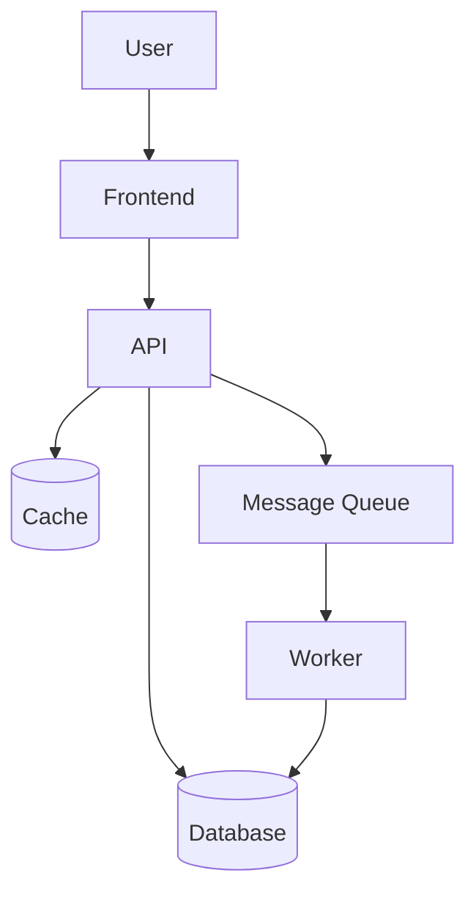

# Senior Architect

System design, architecture decisions, and technical strategy for any scale and any stack.

---

## Step 1: Understand the Context

Before designing or recommending anything, establish:

- **Stage**: prototype / startup / growth / enterprise?
- **Team size**: solo / small (2-5) / medium (6-20) / large (20+)?
- **Traffic**: requests/day? peak load? geographic distribution?
- **Data**: volume? sensitivity? compliance requirements (GDPR, HIPAA, SOC2)?
- **Constraints**: cloud provider, existing stack, budget, timeline?

Ask or infer from project files: `CLAUDE.md`, `README.md`, `package.json`, `docker-compose.yml`, `terraform/`, `.github/workflows/`.

---

## Step 2: Research Current Options

For any significant technology decision, search before recommending:

```
WebSearch: "<decision area> best practices 2025"
WebSearch: "<option A> vs <option B> 2025 comparison"
WebSearch: "<database type> use cases trade-offs 2025"
WebSearch: "<architecture pattern> when to use 2025"
```

This grounds recommendations in current community consensus, not stale knowledge.

---

## Step 3: Architecture Decision Records (ADRs)

Document every significant decision as a MADR (Markdown Any Decision Record):

```markdown
# ADR-NNN: <Title>

**Status**: Proposed | Accepted | Deprecated | Superseded by ADR-NNN

## Context
What is the situation forcing this decision?

## Decision
What are we choosing to do?

## Options Considered
| Option | Pros | Cons |
|--------|------|------|
| A | ... | ... |
| B | ... | ... |

## Consequences
What becomes easier? What becomes harder?

## References
- Link to relevant documentation or prior art
```

Store in `docs/decisions/` or `adr/`.

---

## Step 4: Universal Architecture Principles

### Start Simple, Evolve Deliberately

- **Monolith first**: a well-structured monolith is easier to operate, debug, and evolve than premature microservices
- **Extract when**: a team boundary exists, independent scaling is needed, or a module has a clearly different change rate
- **Strangler fig**: migrate incrementally — route traffic to new services while old ones still run
- **"What would we need to change this decision?"** — design for reversibility, not permanence

### Scalability Patterns

- **Stateless services**: store session in external cache, not in-process memory
- **Database read replicas**: separate read-heavy reporting from write path
- **Async by default**: queue slow work (email, PDF generation, webhooks) — don't block the request
- **Cache aggressively**: CDN -> reverse proxy -> app -> DB; set explicit TTLs; invalidate on write
- **Horizontal scaling**: design services to run as N identical instances behind a load balancer

### Data Architecture

- **Single source of truth**: one system owns each piece of data; others query or subscribe
- **Event sourcing**: consider when audit trail, time-travel, or replay is a requirement
- **CQRS**: separate read and write models when read patterns differ significantly from write patterns
- **Database per service**: in microservices, each service owns its data store; no shared DB
- **Schema migrations**: always backward-compatible during rollout; support zero-downtime deploys

### API Design

- **Contracts first**: define the API contract (OpenAPI, Protobuf, GraphQL schema) before implementation
- **Backward compatibility**: additive changes only (add fields, never remove); version breaking changes
- **Idempotency**: all mutating operations should be safe to retry with the same input
- **Timeouts everywhere**: set timeouts on all network calls; use circuit breakers for downstream services

### Security as Cross-Cutting Concern

- **Defense in depth**: multiple independent security controls — not one perimeter
- **Least privilege**: services, roles, and users get only the permissions they need
- **Secrets management**: no secrets in code or config files; use vault/secret manager
- **mTLS in production**: service-to-service calls should be authenticated and encrypted
- **Threat model early**: identify trust boundaries, data flows, and attack surfaces at design time

### Observability

- **The three pillars**: logs (what happened), metrics (how often / how long), traces (where in the call graph)
- **Structured logs**: JSON with consistent fields (`requestId`, `userId`, `service`, `duration`, `error`)
- **SLOs over SLAs**: define Service Level Objectives for latency and error rate; alert on error budget burn
- **Runbooks**: every alert has a runbook — what is it, why does it fire, what do I do?

---

## Diagram Templates

### System Context (C4 Level 1)

```
[User] --> [Your System] --> [External Service A]
                        --> [External Service B]
                        <-- [Database]
```

### Container Diagram (C4 Level 2) — Mermaid



---

## Review Checklist

Before presenting any architecture recommendation:

- [ ] Context established: stage, team, traffic, data, constraints
- [ ] Current options researched with WebSearch
- [ ] Simplest solution considered first (monolith before microservices)
- [ ] Decision documented as ADR
- [ ] Security threat model included
- [ ] Observability plan included
- [ ] Migration path defined (not greenfield-only)
- [ ] Failure modes considered: what happens when each dependency is unavailable?
- [ ] Cost implications estimated
- [ ] Diagram provided (Mermaid or ASCII)
